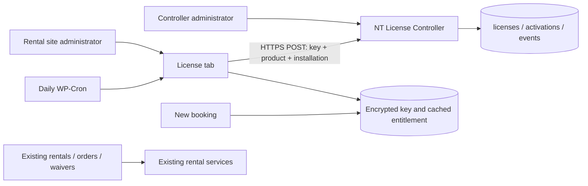

# Licensing Phase 1 architecture

Release: Bike Rental Plugin **0.9.0**, NT License Controller **0.1.0**. Inspected baseline was 0.8.2. This is a new client feature release, with rental schema **2 unchanged**. Controller schema **1** is independent.



Repository boundaries:

```text
bike-rental-plugin/          customer plugin, BikeRentalPlugin namespace
  bike-rental-plugin.php
  src/License.php            transport, cache, schedule and booking guard
  src/LicenseAdmin.php       protected independent License tab
nt-license-controller/      controller plugin, NTLicenseController namespace
  nt-license-controller.php
  src/Store.php              schema, transaction boundary, audit retention
  src/Licenses.php           product-independent entitlement service
  src/Api.php                REST and rate limiting
  src/Admin.php              controller administration
  readme.txt
  uninstall.php
docs/                       shared documentation, excluded from both ZIPs
tests/                      disposable verification, excluded from both ZIPs
```

The controller does not load or require the client, WooCommerce, Square or WPForms. Product slugs are generic lowercase letters/numbers/hyphens, maximum 100 characters. `bike-rental-plugin` is the client product. A license cannot validate another product. The controller creation form offers this slug as a convenience, but accepts other valid products.

## Records and authority

All tables use the site's actual prefix and InnoDB:

| Table | Purpose |
| --- | --- |
| `{prefix}ntlc_licenses` | Product, SHA-256 key hash, final eight-character suffix, purchaser name/email, status, term, UTC issue/expiration/create/update dates, activation limit, notes and nullable billing identifiers |
| `{prefix}ntlc_activations` | License, normalized URL/host/hash, random installation ID, active/inactive status, activation/check/deactivation dates, software versions |
| `{prefix}ntlc_events` | License/activation identifiers, stable event code, optional administrator ID and UTC timestamp; no keys, raw IPs or free-form request payloads |

Terms: lifetime has NULL expiration; monthly and annual require a controller-set expiration. No client subscription arithmetic or automatic renewal. Product, plan and key are immutable after creation; status, expiration, limits and purchaser metadata are editable. Dates are stored in UTC and shown/entered in the WordPress timezone. Invalid local dates, including DST gaps, are rejected; repeated fall-back local times follow PHP's timezone resolution. Administrators should use UTC for an exact cutoff during that ambiguous hour.

Status semantics:

| Status | Meaning |
| --- | --- |
| active | Eligible until its expiration, subject to activation/site checks |
| expired | Ineligible; set explicitly or lazily when an active term has elapsed |
| suspended | Ineligible until administrator restores Active |
| revoked | Ineligible; administrative revocation, which an administrator can explicitly reverse |

Extending a term requires setting its future expiration and Active status. Listing calculates effective expiration even before the next API request records the transition. Suspended/revoked licenses retain their status and occupied activation slots; deactivation is still permitted.

Limits count **active installations**, not historical rows. Positive integer limits are enforced under a controller-wide database advisory lock and transaction. `0` means unlimited. Same key/installation/site activation is idempotent. Deactivation preserves the row and frees its slot. Reactivation reuses that installation row and updates its current timestamps/site; event history retains the transitions. Reducing a limit does not automatically evict active installations; administrators explicitly deactivate surplus sites. A lost database connection cannot write outside the original transaction, and storage errors produce a temporary 503 rather than a definitive license rejection.

## Site identity and security

The client stores a stable 256-bit random installation identifier in a non-autoload option. Controller identity is `(license_id, installation_id)` plus the normalized site URL. Normalize HTTPS scheme/host case, the default 443 port, trailing host dot and trailing path slash. Keep `www`, path case, subdirectory and non-default ports distinct. Reject HTTP, credentials, query/fragment components, whitespace, backslashes, dot-segment/percent-encoded paths and repeated interior slashes. International hostnames must use ASCII/punycode; IPv6 literal URLs are not supported in Phase 1. A changed site URL cannot use cached entitlement or an active controller identity; deactivate the old activation first (controller admin can do this), then activate at the new URL. Cloned sites need their own activation/slot and installation ID; see setup guide.

Keys use `NTL1-` followed by eight groups of eight hex characters generated from `random_bytes(32)`: 256 bits of entropy. Case/outer whitespace are normalized. Controller retains SHA-256 and suffix only. The creation POST displays the key once with no-cache and no-referrer headers; no recoverable raw-key column or key-bearing redirect/transient. Lost keys require replacement and old-license revocation.

Client key storage uses PHP sodium authenticated encryption with a random nonce and a key derived from the site's WordPress auth salt. The option is non-autoloaded; UI redisplays a suffix only and leaves the input empty. A SHA-256 fingerprint permits re-entering the original key after salt rotation without orphaning its activation. Database-only disclosure does not reveal the raw key; someone controlling PHP/config/salts can decrypt or change enforcement. Licensing in distributed PHP is an operational entitlement system, not tamper-proof DRM.

Primary API authorization is possession of the license key and installation identity over verified HTTPS. There is no embedded global shared secret and no ineffective HMAC wrapper pretending otherwise. Requests use WordPress safe HTTP with certificate verification, no redirects, a 10-second timeout and a 16KB response cap. Responses must match product, installation and URL and a strict schema with a timestamp within 15 minutes. Keep both servers' clocks synchronized. Infrastructure must redact request bodies containing credentials; application audit logs never retain keys.

Default abuse controls: 120 requests per direct `REMOTE_ADDR` per UTC hour and 60 per key per UTC hour, configurable 10–10,000 in controller Settings. Short-lived counters store hashed identities. This is basic throttling, not DDoS protection. Configure trusted reverse proxy IP/HTTPS handling server-side; arbitrary forwarded headers are not trusted. Successful validations and repeated denials are capped to one event per installation/code/day; cleanup removes at most 10,000 events older than 180 days per daily run. License/activation rows are never automatically pruned.

## Client cache, grace and enforcement

Activation, Check License Now and daily WP-Cron are the only remote-check paths. Frontend and reservation guards read local state only. A periodic check runs every daily event for an activated key, even if a recent manual check occurred. Cache records validity, status/plan/expiry/counts, site/installation, response code, connection state, last attempt/success, next due time and grace deadline. WP-Cron requires traffic or a server scheduler and can run late; Next Validation is a target rather than a wall-clock guarantee.

A valid response establishes a **seven-day deadline from the last successful validation**, internally defined by `License::GRACE`. Unreachable, malformed, rate-limited or 5xx responses retain prior validity only until this fixed deadline and the known expiration, whichever is earlier. Repeated failures never extend grace. Missing/late cron also enters this bounded grace after the expected check time. A valid, authoritative expired/suspended/revoked/not-activated response immediately removes entitlement with no grace. Never-activated clients cannot gain entitlement through an outage.

Deactivation clears local entitlement even if the request fails and records a pending retry; daily cron retries until the controller acknowledges. Manual Validate cannot undo a pending deactivation. The encrypted key is retained for reuse. A controller-admin deactivation is observed at the next validation; new activation is explicit.

**Compatibility mode is the default**: licensing UI and validation work but do not block existing development installations. Internal `BRP_LICENSE_ENFORCE` or `brp_license_enforcement_enabled` enables enforcement. No public bypass checkbox. `BRP_LICENSE_DEV_MODE` overrides enforcement only when WordPress reports `local` or `development`.

When enforced and invalid, the public catalog/time/availability/new-hold endpoints and new reservation creation are blocked. The shortcode says only: “Online booking is temporarily unavailable. Please contact the rental provider.” Existing hold status/checkout, payment callbacks, reservation edits/returns, WooCommerce orders, waiver evidence and exports keep their existing authorization and business rules. No licensing deletion, table migration or data hiding. Rental pricing, Full Payment mode, Square and deposit behavior are unchanged.

## Administration, privacy and future phases

Controller pages require `manage_options`: Licenses, Add License, Activations, Events and Settings. View/Edit offers status changes (Activate/Suspend/Revoke/Expire), expiration extension, customer metadata and limits; activation rows have a nonce-protected deactivation action. Client License tab also requires `manage_options`, while shop managers retain their existing operational permissions. Both mutation handlers validate nonces and server-side input.

The API collects exactly key, product slug, installation ID, site URL and plugin/WordPress/PHP versions. Purchaser metadata is entered only by the controller administrator. Rental customers, reservations, orders, waivers and signatures never go to the controller.

Future billing adapters can call `Licenses::save()` from trusted authenticated server code. Nullable `billing_provider`, `billing_customer_id` and `billing_subscription_id` reserve the external identity link. A future adapter must add verified webhook handling, event deduplication and auditable mapping/status/expiration updates; these are **not implemented**. No Stripe IDs, credentials, purchase flow, subscriptions or automatic renewals are present.

REST responses already include product, plan/status and `update_entitlement`. That field is true only for a valid licensed installation. A future updater can consume it but must add separately authorized artifact delivery. No WordPress update hooks, package URLs, download tokens or private updater exist in Phase 1.

Deactivation/uninstall preserve both plugins' business records and options; scheduled licensing/cleanup jobs are removed. Uninstall does not contact the controller or release slots automatically: deactivate the license explicitly before uninstalling or use controller administration afterward. Single-site deployments are tested; network activation/provisioning and multisite licensing policy are deferred.

References: [WordPress custom REST endpoints](https://developer.wordpress.org/rest-api/extending-the-rest-api/adding-custom-endpoints/), [safe HTTP POST](https://developer.wordpress.org/reference/functions/wp_safe_remote_post/), [WP-Cron scheduling](https://developer.wordpress.org/reference/functions/wp_schedule_event/), [environment types](https://developer.wordpress.org/reference/functions/wp_get_environment_type/).
