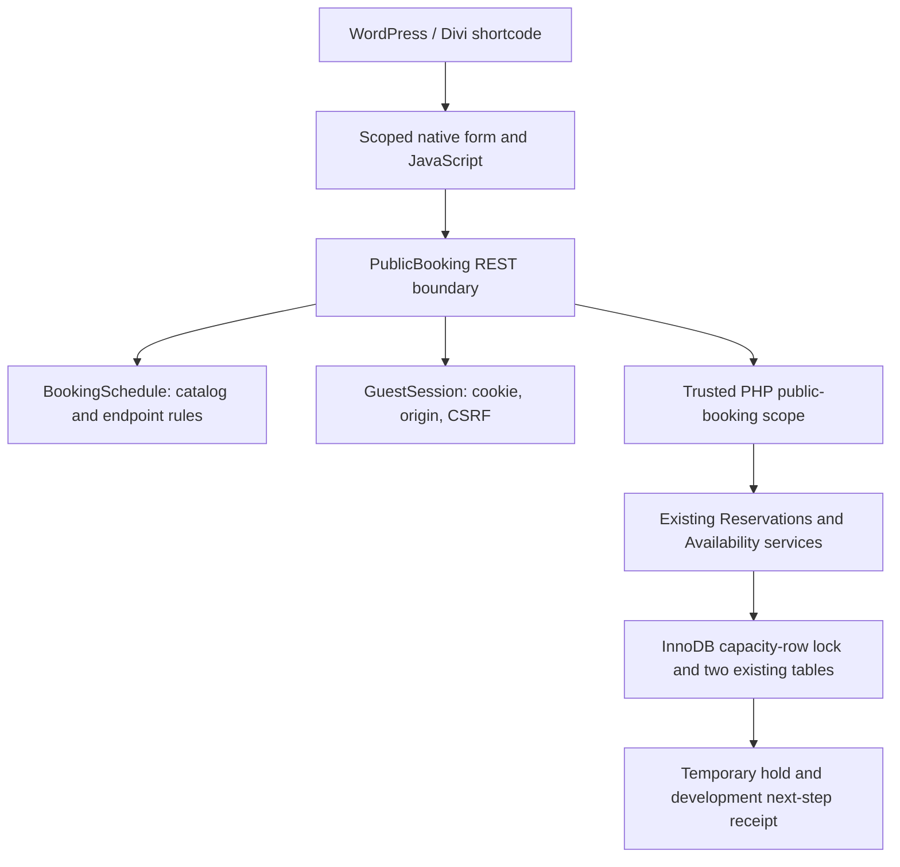

# Milestone 5 — public booking selection, version 0.5.0

Work is on **main**. Plugin version **0.5.0**, schema **1**, with no table/index changes. The user confirmed M1–4 on the dedicated development site. This report covers local M5 implementation and verification. No SFTP deployment, remote site modification, or visual/Divi acceptance is claimed. Milestone 6 has not started.

## Components and flow



`[bike_rental_booking]` returns package/date/time/quantity controls, live messages, actual rental endpoints, and a temporary-hold receipt. The native date picker and opening-derived time select need no external calendar library or Divi module. Labels, fieldset/legend, 48px controls, visible focus, status regions, and scoped CSS are supplied. Assets enqueue only when the shortcode renders; the shortcode prints its stylesheet when necessary for late rendering. Scripts load in the footer. Multiple instances have unique labels and share session initialization.

JavaScript discards stale availability responses when selection changes, disables invalid/loading controls, applies the returned quantity maximum, and submits only package/date/time/quantity/request key. No browser-supplied end, price, status, IDs, or snapshot is accepted. Current selling price is WooCommerce-formatted and labeled per bike; totals/tax/deposit calculations are deferred.

`BookingSchedule` stages current product/settings and derives endpoints. Hourly duration is elapsed UTC time. Calendar-day duration counts start as day 1; N days end on date start+(N-1) at configured pickup. Interior closed days are permitted, but start must be open and before closing, and pickup must be open and at/before closing. No automatic extension occurs. Increment is measured from opening. Minimum notice uses elapsed time, rechecked using database UTC after acquiring the inventory lock. The start-date horizon is inclusive in local dates. DST gaps/repeated local start or end times are rejected; the end may exceed the start-date horizon.

Preparation/turnaround feed the existing occupied-interval sweep. They never change customer-displayed rental times. Active-rental and actual-return policies remain as documented for M4. Public hold creation preserves the selling price, package ID/name/currency/duration/promotion, quantity, local start/end, timezone, and buffer snapshot. Manual creation still uses its prior regular-price contract.

## REST contract

Namespace: `bike-rental/v1`. With pretty permalinks, base path is `/wp-json/bike-rental/v1/`; plain WordPress REST query URLs also work. All responses have `Cache-Control: no-store, private, max-age=0` and vary by Cookie/Origin. Configure host/CDN rules to respect that and never cache the protected POST routes.

| Method / route | Required input | Result |
|---|---|---|
| GET `packages` | None | Active published valid package catalog, current formatted selling prices, date min/max and timezone |
| GET `times` | `package_id`, `date` | Valid operating start times that currently have at least one available bike |
| GET `availability` | `package_id`, `date`, `time` | `valid`, `rental_start`, `rental_end`, `timezone`, `available_quantity`, public package, friendly message |
| POST `session` | No body fields; same-origin/custom header | Signed HttpOnly cookie and CSRF token |
| POST `holds` | `package_id`, `date`, `time`, `quantity`, `request_key`; cookie/token/origin | Reference, package, quantity, actual endpoints/timezone, expiry/server time, reserved flag, next-step message |
| POST `hold-status` | `request_key`; cookie/token/origin | Same public receipt for that guest's owned result only |

Input dates are `YYYY-MM-DD`; times are `HH:MM`. Unknown/missing fields and malformed scalars are rejected. There is no public cancel, edit, confirm, admin-record lookup, or private diagnostic endpoint. GET cannot invoke hold creation. Read responses do not include reservations, notes, customer details, occupied buffer times, database IDs, raw snapshots, or hashes.

POST requests require `Origin` equal to the site's home origin and `X-BRP-Request: 1`. Hold/status additionally require `X-BRP-Token` matching the current signed cookie's CSRF token. Cookie `brp_guest_{blog_id}` contains a random 256-bit identifier, one-day expiry, and HMAC signature; it is HttpOnly, SameSite=Lax, path `/`, host-only, and Secure on HTTPS. Only its keyed hash is stored on reservations. Tokens are obtained through a fresh same-origin POST, not embedded in potentially cached shortcode markup. A tampered cookie or another guest's token/key cannot access a hold. No WordPress user escalation or guest-wide WP nonce is used.

Advisory transient limits allow 90 non-hold requests and 20 hold requests per IP per minute. IP keys are hashed and expire; forwarded IP headers are not trusted. These approximate limits can be affected by shared proxies/races and are not a complete bot defense. Inventory correctness always depends on the existing InnoDB lock.

## Holds and refresh behavior

The protected controller enters `Database::public_booking()` only for validated operations, restoring that scope on exit. Core administrator methods remain denied to anonymous calls outside it. Creation runs the M4 request-key/session matching and shared capacity-row lock. Same intent/key/session reuses the saved result without extending expiry; changed intent/session is rejected. One unexpired public hold per guest session is enforced under the same lock.

The browser remembers the opaque request key in session storage before submission, retries it after uncertain network failure, and retrieves its owned receipt after refresh. The signed cookie remains the ownership authority. If storage is unavailable, in-page retries still work, but automatic refresh recovery is unavailable. A cookie expiry/reset loses access to the old receipt; it does not renew/reallocate the hold. Existing holds expire normally.

Holds last 15 minutes. The receipt uses returned server time to offset its simple countdown, shows expiry, and offers Start over when no longer reserved. Expired timestamps are treated as released even if the existing five-minute, 100-row cleanup has not yet changed status. No checkout/payment success is implied. `PublicBooking::next_step_message()` isolates the requested development-only copy for replacement in M6.

## Verification results

Test environment: Windows, PHP 8.3.33, WordPress 6.8.3, WooCommerce 10.2.2, MariaDB 11.4.8 with real InnoDB tables, all on a disposable loopback fixture. No customer data or remote credentials were used.

| Suite | Checks |
|---|---:|
| Foundation/package API-double regressions | 208 |
| Real storage regressions | 159 |
| Real editing regressions | 96 |
| M4 availability regressions | 98 |
| Independent-process concurrency | 45 |
| Public booking REST/scheduling/security integration | 74 |
| Missing-WooCommerce regressions | 10 |
| **Total passed** | **690** |

The 45 concurrency checks preserve the previous 40 and add two anonymous REST callers competing for the last bike. Separate PHP processes have distinct database connection IDs. A coordinator holds capacity row 1 until both workers are observed simultaneously waiting in real InnoDB lock metadata. Exactly one public hold succeeds, the other gets a safe HTTP 409 capacity response, and only one row is saved.

Repeated runs initially shared advisory rate counters, causing one race request to receive 429 before reaching the inventory lock. Fixtures now use a fresh synthetic client IP per run (both race workers share that IP). Production rate limiting remains enabled and unchanged; test runs no longer interfere with each other.

Public integration checks cover active/published/selling-price filtering, malformed/missing/private fields, notice/horizon/opening/increment rules, hourly/calendar endpoints, both DST transitions, peak availability, buffer isolation, guest cookie/CSRF/origin/ownership, idempotency, final allocation rejection, expiry before cleanup, shortcode/assets/CSS, and safe SQL failure responses without printed diagnostics. Older static tests were updated only to allow the newly authorized shortcode/REST surface while continuing to forbid checkout/orders/cart/remote calls/stock sync.

Actual local HTTP checks separately verify a WordPress page renders the shortcode and versioned assets, two active fixture packages appear, HttpOnly/SameSite cookie flags and no-store headers are emitted, a cookie/token-protected hold succeeds, and duplicate POST returns the same reference. No PHP warnings or fatal errors appeared in that HTTP log. These supplementary checks are not added to the 690 suite total.

All **31 PHP files** pass syntax checks; `booking.js` compiles as JavaScript; staged whitespace and unchanged schema definitions are verified. **Visual, mobile, keyboard, countdown interaction, and Divi rendering are not verified locally:** the browser tools returned “No browser is available” and “Browser is not available: iab.” HTTP/static checks do not substitute for those remaining tests.

For reproduction, use the strict disposable environment guards documented in [M4 verification](availability-verification.md). Run database suites sequentially: `tests/availability.php` (353 combined regressions), `tests/public-booking.php` (74), and `tests/availability-concurrency.php` (45). Rebuild fixtures with `tests/reservation-editing.php` before the 10 missing-WooCommerce tests; toggle WooCommerce only in the disposable fixture and restore it afterward. Run `tests/packages.php` separately (208). Do not run fixture-reset scripts on the dedicated development site containing records to retain.

## Remaining dedicated-site acceptance

1. Back up and upload the complete inner plugin folder; confirm 0.5.0/schema 1 and preserved M1–4 data.
2. Create a normal WordPress/Divi test page and insert `[bike_rental_booking]`.
3. Confirm active published rental packages, current selling prices, durations, and promotions; inactive/non-rental/draft products must be absent.
4. Select an hourly package, valid date/time, and quantity; verify endpoint, availability count, and large usable controls.
5. Verify no past/out-of-horizon starts, minimum notice, opening-relative increments, and invalid/closed endpoints.
6. Create a hold; confirm reference, package, quantity, actual endpoints, unit price, expiry, and development next-step copy.
7. Inspect its admin status, expiry, snapshot, and request/session association indicators; confirm capacity consumption.
8. Refresh and retry the original submission; confirm one reservation. Check blocked cookies and network-error feedback.
9. Use another private browser session and confirm it cannot retrieve the first session's hold using the key/token.
10. Wait past expiry with cleanup delayed if practical; verify expired display, Start over, immediate capacity release, and later cleanup.
11. Attempt quantity above remaining availability, including competing final-bike requests; confirm no overbooking.
12. Verify zero-availability and closed-start-day feedback; test buffers without changing displayed rental endpoints.
13. Test three calendar days ending on day 3, not day 4; closed interior days allowed, closed pickup rejected without extension.
14. Test mobile widths, date input, keyboard order/focus, screen-reader status messages, no horizontal scrolling, loading controls, and countdown. Check multiple shortcode instances and the actual Divi layout.
15. Verify no cart, order, checkout redirect, Square call, deposit flow, waiver, rider tasks, email, or admin calendar change.
16. Verify no database/private errors appear in the page or REST responses. Confirm HTTPS cookie flags, first-party origin, and cache exclusions on the real host.

## Known limits and handoff

No local automated failures remain. The host/version matrix and visual/Divi acceptance above are pending. JavaScript and first-party cookies are required; storage improves refresh recovery. Public cancellation/replacement of a live hold is deferred; wait for expiry before starting another. Prices are per-bike stored selling values formatted by WooCommerce, with no checkout tax/deposit computation. Package/settings data are staged on the server before allocation; catalog changes do not rewrite saved snapshots. Legacy NULL-expiry holds and conservative active-until-return behavior remain unchanged.

New runtime files: `src/BookingSchedule.php`, `src/GuestSession.php`, `src/PublicBooking.php`, `src/booking-form.php`, `assets/js/booking.js`, `assets/css/booking.css`.

Changed runtime files: main plugin file, `readme.txt`, `src/Plugin.php`, `src/Database.php`, `src/Reservations.php`, `src/reservations-page.php`. New test: `tests/public-booking.php`. Updated tests: `foundation.php`, `packages.php`, `reservations.php`, `inventory-worker.php`, `availability-concurrency.php`. Documentation: README, CHANGELOG, storage contract, and this report. Historical milestone reports retain their original scope/counts.

Recommended commit message: `Add public rental selection and protected guest holds for version 0.5.0`.

Exact SFTP source:

```text
C:\Users\RandyNewby\Documents\GitHub\bike-rental-plugin\bike-rental-plugin\
```

Destination relative to the WordPress installation:

```text
wp-content/plugins/bike-rental-plugin/
```

Upload the complete inner directory, including new classes and both front-end assets. No build, Composer, Node.js, or server-side CLI is required. Do not upload the repository root, tests, docs, `.git`, temporary logs, or verification dependencies. No remote absolute path is asserted because none was supplied.

**Stop after Milestone 5. Milestone 6 has not started.**
