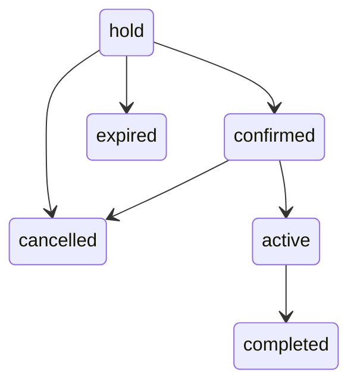

# Reservation storage — version 0.3.1

Corrective Milestone 3 update only. Plugin version **0.3.1**; database schema version remains **1** in `brp_db_version`. No columns, tables, or indexes changed in this correction. The custom plugin alone owns shared rental capacity. Product stock and payment gateway stock have no role in these tables.

## Tables and indexes

Exactly two custom tables use `$wpdb->prefix` and the database's WordPress charset/collation, with **InnoDB**. The examples below omit the configurable prefix. All `datetime` fields store UTC; timestamps are written explicitly by the application. No card data, billing/shipping addresses, signatures, or credentials are stored.

### `{prefix}brp_reservations`

| Field | SQL type / contract |
|---|---|
| `id` | bigint unsigned, auto-increment primary key |
| `reference` | varchar(40), required, unique; `BRP-YYYYMMDD-` plus 16 random hexadecimal characters; date is UTC |
| `order_id`, `order_item_id` | bigint unsigned, nullable; reserved for later WooCommerce integration |
| `package_product_id` | bigint unsigned, required; WooCommerce product ID at creation |
| `quantity` | int unsigned, required |
| `start_utc`, `end_utc` | datetime, required; end strictly after start |
| `occupied_start_utc`, `occupied_end_utc` | datetime, required; rental interval expanded by the captured preparation/turnaround buffers |
| `timezone` | varchar(64), required; WordPress timezone at the last schedule save |
| `status` | varchar(20), required; one of the six validated lifecycle statuses |
| `hold_expires_at` | datetime, nullable; unused for manual test holds in this milestone |
| `request_key` | varchar(64), nullable, unique when non-null; future checkout idempotency identifier |
| `request_hash`, `session_hash` | varchar(64), nullable; reserved and not populated in Milestone 3 |
| `snapshot` | longtext, required JSON current agreed reservation snapshot; no direct JSON editing |
| `revision` | bigint unsigned, required, initial 1; increments on actual changes |
| `issue_code` | varchar(64), nullable; optional sanitized issue code/short internal note, maximum 64 UTF-8 bytes |
| `created_at`, `updated_at` | datetime, required UTC |

Indexes:

- `PRIMARY (id)`
- `UNIQUE reference (reference)`
- `UNIQUE request_key (request_key)`; MySQL permits multiple NULLs
- `status_interval (status, occupied_start_utc, occupied_end_utc)`
- `occupied_end (occupied_end_utc)`
- `hold_expiry (status, hold_expires_at)`
- `order_id (order_id)`
- `order_item_id (order_item_id)`

There are no foreign keys to WordPress/WooCommerce tables. A removed or changed product must not remove a historical reservation. Related order links are obtained using `wc_get_order()` and the order's `get_edit_order_url()`, never direct order-table SQL.

### `{prefix}brp_availability`

| Field | SQL type / contract |
|---|---|
| `id` | bigint unsigned, auto-increment primary key; **1 is reserved for capacity** |
| `record_type` | varchar(20), required; `capacity` or `block` |
| `quantity` | int unsigned, required; application accepts positive integers up to 2147483647 |
| `start_utc`, `end_utc` | nullable datetime; capacity has neither; blocks require start and may have indefinite end |
| `reason` | varchar(240), required, default empty; blocks require sanitized text, maximum 240 UTF-8 bytes |
| `active` | tinyint unsigned, default 1; validated 0/1; capacity remains active |
| `created_by` | bigint unsigned, default 0; WordPress user ID for blocks; setup capacity uses 0 |
| `created_at`, `updated_at` | datetime, required UTC |

Indexes: `PRIMARY (id)`, `type_interval (record_type, active, start_utc, end_utc)`, `block_end (end_utc)`.

Only the installer creates capacity, using reserved primary key 1 and a no-change duplicate-key clause. The seed quantity is 10 only on first creation. Installation verifies exactly one capacity row, its type, quantity, and active flag. All other service inserts use type `block`; neither block update nor disable can target capacity. Unexpected manually inserted capacity duplicates stop installation with a repair notice; they are not silently deleted.

## Installation, locking, and failure handling

Normal `init` at priority 20 checks the schema option. Activation does not need to create tables itself; the next ordinary request performs installation. SFTP replacement therefore works without reactivation. A matching successful version performs no DDL. Repeated migration execution is also idempotent.

Installation acquires a per-database/prefix MySQL named lock, runs WordPress `dbDelta()`, verifies engine, required columns and index column sequences/uniqueness, and inserts only a missing capacity seed. The schema version is recorded only after verification. DDL is deliberately outside a transaction because MySQL implicitly commits DDL. A partial failure is recoverable on the next initialization; no DROP/TRUNCATE/recreate or business-data rewrite is used. `brp_db_error` shows administrators an actionable error and blocks service reads/writes until recovery. Newer schema versions are never downgraded automatically.

Short InnoDB transactions lock capacity row 1 before changing fleet quantity, saving/disabling a block, or validating/inserting/updating a reservation schedule. This serializes individual quantity-bound validation against fleet changes. It is **not** the future overlap/availability allocation algorithm. A failed operation or commit rolls back. Services own their transaction boundary and should not be called inside an existing transaction.

Reservation updates also compare the caller's expected revision in the SQL update predicate. This prevents stale schedule/status forms from overwriting newer changes. Same-value saves do nothing; repeated stale requests return a reload error. This is not checkout callback or payment idempotency; those integrations remain deferred.

Deactivation and uninstall preserve tables, rows, options, and product metadata. Site backups remain the administrator's responsibility. Returning temporarily to 0.2.0 leaves the tables unused and intact; future schema downgrades require an explicit compatible migration plan.

## Service contracts

All persistent service methods require `manage_options` or `manage_woocommerce` and a ready schema. Methods return the value/record shown below or `WP_Error`; they do not redirect or render. PHP callers perform their own request nonce checks. The administration controller checks an operation/record-bound WordPress nonce for every mutation.

| Method | Contract |
|---|---|
| `Fleet::capacity()` | Current positive integer from capacity row 1 |
| `Fleet::set_capacity($quantity)` | Persist/return quantity; reject below any individual active current/upcoming block |
| `Fleet::block($id)` | Block row; rejects capacity and invalid IDs |
| `Fleet::save_block($input, $id = null)` | Create or edit block; input `quantity`, local `start`, optional local `end`, `reason`, `active` |
| `Fleet::disable_block($id)` | Persist inactive flag and return retained block |
| `Reservations::create($input)` | Input `package_product_id`, `quantity`, local `start`, local `end`, `status` (default hold); return stored row |
| `Reservations::read($id)` | Stored row including JSON snapshot string, with no live package dependency |
| `Reservations::update($id, $input, $expected_revision)` | Administrative correction for any valid status: package, quantity, local start/end, status, issue code; regenerate current state snapshot only on actual changes |
| `Reservations::change_status($id, $status, $expected_revision)` | Apply validated lifecycle transition and revision check |
| `Reservations::cancel($id, $revision)` | Transition to cancelled; no deletion |
| `Reservations::mark_active($id, $revision)` | Confirmed → active |
| `Reservations::mark_completed($id, $revision)` | Active → completed |
| `Reservations::reference()` | Generate a random display reference; table unique index is the final uniqueness guarantee |
| `Database::listing($kind, $page = 1)` | `reservations` or `availability` block records; `rows`, `total`, `page`; 25 rows per page, newest IDs first |
| `RentalTime::from_local($value)` | Strict local `YYYY-MM-DDTHH:MM` → UTC SQL datetime or error |
| `RentalTime::display($utc, $input = false)` | Current WordPress-local presentation, or form value when `$input` is true |

New reservations require a published, active Simple rental package with valid duration and entered regular price. Quantity must fit total fleet, even though aggregate availability is not checked. Manual start/end values do not yet enforce package duration, business hours, notice, time increments, or horizon. Valid supported input years are 1001–9998, allowing UTC/buffer conversion to remain within MySQL datetime bounds. Named and fixed-offset WordPress timezones are supported; impossible and repeated local clock times are rejected. The server default timezone is never used.

Snapshot keys: `product_id`, `name`, `price` (decimal string), `currency`, `duration_type`, `duration_amount`, `promotional_label`, `local_start`, `local_end`, `timezone`, `quantity`, `status`, and `buffers` containing `preparation_buffer`/`turnaround_buffer`. New manual creation retains the prior regular-price contract. Package replacements use WooCommerce `get_price('edit')` for the current selling price, including an active sale; no tax or coupon calculation is performed. The Milestone 2 package API itself still returns regular prices.

Catalog changes alone never rewrite agreed package terms. A retained package must still be a valid rental package, but may be inactive/unpublished; replacements must be published, active, and priced. Dates/quantity/status edits refresh those values in the current snapshot while preserving its package name, price, duration, promotion, and currency. Package replacement refreshes those package terms too. All edits reuse the reservation's existing buffer snapshot. Raw snapshot JSON is never accepted from the client.

There is no audit/history table, nor automatic retention of previous snapshot revisions, in 0.3.1. Future audit/history functionality may retain old revisions. Existing rows are not bulk migrated or silently rewritten; older snapshots gain current quantity/status on their next real reservation change, while no-op saves preserve their existing bytes. Order IDs, reference, creation time, IDs, request/session fields, WooCommerce orders, and other reservations remain unchanged. Modification timestamps record actual UTC with existing one-second precision; revision identifies separate saves within the same second. No totals, taxes, payments, customer identities, or signatures are collected.

Ordinary lifecycle helper transitions (`change_status`, `cancel`, `mark_active`, `mark_completed`):



Completed, cancelled, and expired are terminal for ordinary lifecycle helpers. The full administrative correction form and `Reservations::update()` allow any of the six validated statuses, and permit field edits on every status, as required for development testing. Initial manual creation also permits all six statuses. Manual holds have nullable expiry and no scheduled expiry processing. Payment and waiver state will remain separate in future milestones.

The edit form submits `package_product_id`, `quantity`, `start`, `end`, `status`, `issue_code`, and `revision`, plus its operation/record-bound nonce and WordPress timezone. Missing form fields, invalid values, changed form timezone, or stale revision reject the entire save. Existing PHP callers may omit package/status/issue to retain those values, but full form submissions must include all fields. No availability conflict checks are added; the edit page explicitly warns that these development edits are for testing only.

## Runtime folder structure

```text
bike-rental-plugin/
  bike-rental-plugin.php
  readme.txt
  uninstall.php
  src/
    Plugin.php
    Settings.php
    settings-page.php
    Packages.php
    package-fields.php
    packages-page.php
    Database.php
    RentalTime.php
    Fleet.php
    Reservations.php
    DataAdmin.php
    fleet-page.php
    reservations-page.php
  assets/
    css/.gitkeep
    js/.gitkeep
    js/package-admin.js
  languages/.gitkeep
```

Repository-only tests and documentation are outside that deployable directory. No build tools or additional runtime dependencies are introduced. **Milestone 4 has not started.**
