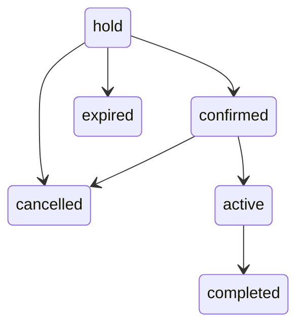

# Reservation storage — version 0.5.0

Milestone 5 public selection uses the existing allocation services. Plugin version **0.5.0**; schema remains **1** in `brp_db_version`. No columns, tables, or indexes changed. The custom plugin alone owns rental capacity. Product/payment gateway stock has no role in these tables. See [M4 allocation evidence](availability-verification.md) and [current public booking verification](public-booking-verification.md).

## Tables and indexes

Exactly two custom tables use `$wpdb->prefix` and the database's WordPress charset/collation, with **InnoDB**. The examples below omit the configurable prefix. All `datetime` fields store UTC; timestamps are written explicitly by the application. No card data, billing/shipping addresses, signatures, or credentials are stored.

### `{prefix}brp_reservations`

| Field | SQL type / contract |
|---|---|
| `id` | bigint unsigned, auto-increment primary key |
| `reference` | varchar(40), required, unique; `BRP-YYYYMMDD-` plus 16 random hexadecimal characters; date is UTC |
| `order_id`, `order_item_id` | bigint unsigned, nullable; reserved for later WooCommerce integration |
| `package_product_id` | bigint unsigned, required; WooCommerce product ID at creation |
| `quantity` | int unsigned, required |
| `start_utc`, `end_utc` | datetime, required; end strictly after start |
| `occupied_start_utc`, `occupied_end_utc` | datetime, required; rental interval expanded by the captured preparation/turnaround buffers |
| `timezone` | varchar(64), required; WordPress timezone at the last schedule save |
| `status` | varchar(20), required; one of the six validated lifecycle statuses |
| `hold_expires_at` | datetime, nullable; new holds expire 15 minutes after the locked database clock; retained after status changes |
| `request_key` | varchar(64), nullable, unique when non-null; normalized lowercase ASCII letters/digits/underscore/hyphen, 1–64 characters; identifies creation intent |
| `request_hash`, `session_hash` | varchar(64), nullable; lowercase SHA-256 hexadecimal hashes; server-derived intent and caller-provided hashed session identity for holds |
| `snapshot` | longtext, required JSON current agreed reservation snapshot; no direct JSON editing |
| `revision` | bigint unsigned, required, initial 1; increments on actual changes |
| `issue_code` | varchar(64), nullable; optional sanitized issue code/short internal note, maximum 64 UTF-8 bytes |
| `created_at`, `updated_at` | datetime, required UTC |

Indexes:

- `PRIMARY (id)`
- `UNIQUE reference (reference)`
- `UNIQUE request_key (request_key)`; MySQL permits multiple NULLs
- `status_interval (status, occupied_start_utc, occupied_end_utc)`
- `occupied_end (occupied_end_utc)`
- `hold_expiry (status, hold_expires_at)`
- `order_id (order_id)`
- `order_item_id (order_item_id)`

There are no foreign keys to WordPress/WooCommerce tables. A removed or changed product must not remove a historical reservation. Related order links are obtained using `wc_get_order()` and the order's `get_edit_order_url()`, never direct order-table SQL.

### `{prefix}brp_availability`

| Field | SQL type / contract |
|---|---|
| `id` | bigint unsigned, auto-increment primary key; **1 is reserved for capacity** |
| `record_type` | varchar(20), required; `capacity` or `block` |
| `quantity` | int unsigned, required; application accepts positive integers up to 2147483647 |
| `start_utc`, `end_utc` | nullable datetime; capacity has neither; blocks require start and may have indefinite end |
| `reason` | varchar(240), required, default empty; blocks require sanitized text, maximum 240 UTF-8 bytes |
| `active` | tinyint unsigned, default 1; validated 0/1; capacity remains active |
| `created_by` | bigint unsigned, default 0; WordPress user ID for blocks; setup capacity uses 0 |
| `created_at`, `updated_at` | datetime, required UTC |

Indexes: `PRIMARY (id)`, `type_interval (record_type, active, start_utc, end_utc)`, `block_end (end_utc)`.

Only the installer creates capacity, using reserved primary key 1 and a no-change duplicate-key clause. The seed quantity is 10 only on first creation. Installation verifies exactly one capacity row, its type, quantity, and active flag. All other service inserts use type `block`; neither block update nor disable can target capacity. Unexpected manually inserted capacity duplicates stop installation with a repair notice; they are not silently deleted.

## Installation, locking, and failure handling

Normal `init` at priority 20 checks the schema option. Activation does not need to create tables itself; the next ordinary request performs installation. SFTP replacement therefore works without reactivation. A matching successful version performs no DDL. Repeated migration execution is also idempotent.

Installation acquires a per-database/prefix MySQL named lock, runs WordPress `dbDelta()`, verifies engine, required columns and index column sequences/uniqueness, and inserts only a missing capacity seed. The schema version is recorded only after verification. DDL is deliberately outside a transaction because MySQL implicitly commits DDL. A partial failure is recoverable on the next initialization; no DROP/TRUNCATE/recreate or business-data rewrite is used. `brp_db_error` shows administrators an actionable error and blocks service reads/writes until recovery. Newer schema versions are never downgraded automatically.

Short InnoDB transactions lock capacity row 1 before every inventory mutation, then perform fresh locking reads, shared availability validation, guarded writes, and checked commit. Block/reservation replacements exclude their current row. Fleet reductions validate peak combined usage from the database's current UTC time through all future commitments. Product/snapshot preparation occurs outside the transaction. A failed operation or commit rolls back. Services own their transaction boundary and must not be called inside an existing transaction.

`Database::locked($callback, $cleanup = false)` makes one attempt and passes current capacity into the callback. `Database::now()` supplies the database UTC clock captured after acquiring the lock. `Database::insert()` and `update()` are internal guarded-write helpers requiring that lock; their SQL includes a connection-session token predicate. This prevents WordPress's reconnect retry from writing after losing the lock. `Database::read()` uses `FOR UPDATE` inside a rental transaction. Normal conflicts return `brp_conflict` with aggregate quantities; lock/SQL failures return `brp_retry` with `retryable = true`. Failed statements are never retried inside the transaction. Even a random reference collision requires a fresh caller retry. A failed commit acknowledgement can leave an uncertain outcome; reload and reuse the original request key instead of generating a new creation request.

Reservation updates also compare the caller's expected revision in the SQL update predicate. This prevents stale schedule/status forms from overwriting newer changes. Same-value saves do nothing; repeated stale requests return a reload error. Creation request keys provide allocation idempotency; checkout callback and payment integration remain deferred.

Deactivation clears the cleanup schedule. Deactivation and uninstall preserve tables, rows, rental options, and product metadata. Site backups remain the administrator's responsibility. Older code does not enforce availability; disable allocation during any rollback. Future schema downgrades require an explicit compatible migration plan.

## Service contracts

Ordinary service methods require `manage_options` or `manage_woocommerce` and a ready schema. The registered cron action permits anonymous expired-hold housekeeping. M5 adds `Database::public_booking($callback)`, a trusted PHP scope entered only by the public controller after parameter and guest validation. It restores the prior gate state in `finally` without changing WordPress users/capabilities. Admin mutations retain operation/record-bound nonces. Public holds instead require signed-cookie ownership, same-origin/custom-header checks, and a session-bound CSRF token. The public controller returns only allowlisted customer fields and cannot cancel, edit, or confirm arbitrary reservations. Methods return data or `WP_Error`; they do not render or redirect.

| Method | Contract |
|---|---|
| `Fleet::capacity()` | Current positive integer from capacity row 1 |
| `Fleet::set_capacity($quantity)` | Persist/return quantity; reductions must support peak combined current/future consumption |
| `Fleet::block($id)` | Block row; rejects capacity and invalid IDs |
| `Fleet::save_block($input, $id = null)` | Create or edit block; input `quantity`, local `start`, optional local `end`, `reason`, `active` |
| `Fleet::disable_block($id)` | Persist inactive flag and return retained block |
| `Reservations::create($input)` | Input `package_product_id`, `quantity`, local `start`, local `end`, `status` (default hold), optional stable `request_key`; return stored row; consuming states must fit |
| `Reservations::create_hold($input, $request_key, $session_hash)` | Force hold status, compute intent hash, set 15-minute expiry, reuse matching prior result; reject conflicting key/session |
| `Reservations::create_booking_hold($input, $request_key, $session_hash)` | Protected public path: package ID, date/time, quantity; derive endpoints and selling-price snapshot; recheck notice/allocation under lock; one live public hold per guest |
| `Reservations::read($id)` | Stored row including JSON snapshot string, with no live package dependency |
| `Reservations::update($id, $input, $expected_revision)` | Administrative correction for any valid status: package, quantity, local start/end, status, issue code; regenerate current state snapshot only on actual changes |
| `Reservations::change_status($id, $status, $expected_revision)` | Apply validated lifecycle transition and revision check |
| `Reservations::cancel($id, $revision)` | Transition to cancelled; no deletion |
| `Reservations::mark_active($id, $revision)` | Confirmed → active |
| `Reservations::mark_completed($id, $revision)` | Active → completed |
| `Reservations::confirm_hold($id, $revision)` | Hold/expired → confirmed after locked capacity recheck; same confirmed revision is a no-op |
| `Reservations::expire_holds()` | Lock and mark up to 100 timestamp-expired holds; return count; no deletion |
| `Availability::check($start, $end, $quantity = 1, $reservation_id = null, $block_id = null)` | UTC occupied interval; optional null end means indefinite; return aggregate capacity result under lock |
| `Availability::evaluate($capacity, $start, $end, $quantity = 1, $reservation_id = null, $block_id = null)` | Internal shared sweep; requires caller already owns inventory transaction |
| `HoldCleanup::schedule()` / `deactivate()` | Guarded single five-minute cron registration / clear the plugin hook |
| `Reservations::reference()` | Generate a random display reference; table unique index is the final uniqueness guarantee |
| `Database::listing($kind, $page = 1)` | `reservations` or `availability` block records; `rows`, `total`, `page`; 25 rows per page, newest IDs first |
| `RentalTime::from_local($value)` | Strict local `YYYY-MM-DDTHH:MM` → UTC SQL datetime or error |
| `RentalTime::display($utc, $input = false)` | Current WordPress-local presentation, or form value when `$input` is true |

New reservations require a published, active Simple rental package with valid duration and entered regular price. Quantity must fit total fleet; consuming states must fit aggregate availability. Manual start/end values do not yet enforce package duration, business hours, notice, time increments, or horizon. Valid supported local input years are 1001–9998, allowing UTC/buffer conversion to remain within MySQL datetime bounds. Named and fixed-offset WordPress timezones are supported; impossible and repeated local clock times are rejected. The server default timezone is never used.

Snapshot keys: `product_id`, `name`, `price` (decimal string), `currency`, `duration_type`, `duration_amount`, `promotional_label`, `local_start`, `local_end`, `timezone`, `quantity`, `status`, and `buffers` containing `preparation_buffer`/`turnaround_buffer`. New manual creation retains the prior regular-price contract. Package replacements use WooCommerce `get_price('edit')` for the current selling price, including an active sale; no tax or coupon calculation is performed. The Milestone 2 package API itself still returns regular prices.

Catalog changes alone never rewrite agreed package terms. A retained package must still be a valid rental package, but may be inactive/unpublished; replacements must be published, active, and priced. Dates/quantity/status edits refresh those values in the current snapshot while preserving its package name, price, duration, promotion, and currency. Package replacement refreshes those package terms too. All edits reuse the reservation's existing buffer snapshot. Raw snapshot JSON is never accepted from the client.

There is no audit/history table or automatic retention of previous snapshot revisions in 0.5.0. Future history functionality may retain old revisions. Existing rows are not bulk migrated; older snapshots gain current quantity/status on their next real change, while no-op saves preserve bytes. Order IDs, reference, created time, IDs, existing request/session identity, WooCommerce orders, and other reservations remain unchanged. Returning a non-hold to hold fills missing identity and starts a fresh expiry under lock. Modified times retain one-second UTC precision; revision distinguishes separate saves. No totals, taxes, payments, rider identities, or signatures are collected.

Public holds use current WooCommerce selling price rather than the manual creation reader's regular price. `BookingSchedule` derives elapsed-hour or inclusive calendar-day endpoints, validates public opening/notice/increment/horizon rules, and captures the same snapshot keys and buffers. Products/settings are staged on the server before allocation; the final locked check revalidates notice against database UTC. Raw request/session values are never customer-editable or exposed; administration displays only association presence. Existing manual explicit-date behavior is preserved.

Ordinary lifecycle helper transitions (`change_status`, `cancel`, `mark_active`, `mark_completed`):



Completed, cancelled, and expired are terminal for ordinary lifecycle helpers; `confirm_hold()` explicitly permits reallocation of an expired result when it fits. The full administrative correction form and `Reservations::update()` allow any of the six validated statuses, and permit field edits on every status, as required for development testing. Initial manual creation also permits all six statuses. New holds expire after 15 minutes. Existing expired hold edits do not silently renew expiry; an explicit non-hold → hold correction creates a fresh hold. Payment and waiver state will remain separate in future milestones.

Active reservations consume from occupied start indefinitely until completion, including future queries. Switching to active therefore checks that extended allocation against future commitments. Actual active → completed saves atomically create a dated block for the old row's quantity and captured turnaround minutes, starting at database UTC now; zero turnaround creates no block. Completed rows themselves do not consume. These blocks are inspectable/editable in Fleet under the same rules as other blocks.

Holds with NULL legacy expiry do not consume and are not auto-renewed/auto-expired. A hold with expiry at or before database UTC now is immediately ignored by the sweep, even if its status still says hold. The five-minute cleanup processes at most 100 such rows per run and increments revision/snapshot status. It is idempotent and independent of availability correctness.

The edit form submits `package_product_id`, `quantity`, `start`, `end`, `status`, `issue_code`, and `revision`, plus its operation/record-bound nonce and WordPress timezone. Missing form fields, invalid values, changed form timezone, stale revision, or insufficient replacement availability reject the entire save. Existing PHP callers may omit package/status/issue to retain those values, but full form submissions must include all fields. The edit page explains availability enforcement and the absence of payment/fulfillment verification.

## Runtime folder structure

```text
bike-rental-plugin/
  bike-rental-plugin.php
  readme.txt
  uninstall.php
  src/
    Plugin.php
    Settings.php
    settings-page.php
    Packages.php
    package-fields.php
    packages-page.php
    Database.php
    RentalTime.php
    Fleet.php
    Reservations.php
    Availability.php
    HoldCleanup.php
    BookingSchedule.php
    GuestSession.php
    PublicBooking.php
    booking-form.php
    DataAdmin.php
    fleet-page.php
    reservations-page.php
  assets/
    css/.gitkeep
    css/booking.css
    js/.gitkeep
    js/package-admin.js
    js/booking.js
  languages/.gitkeep
```

Repository-only tests and documentation are outside that deployable directory. No build tools or additional runtime dependencies are introduced. **Milestone 6 has not started.**
