# Milestone 8 schema and workflow design

Updated for runtime 0.8.1. Schema remains 2; no table/column/index changes in this release.

## Non-destructive migration

Keep reservations and availability columns unchanged. Add two InnoDB tables using the existing serialized dbDelta migration and verification. No rows are deleted or retroactively downgraded. Existing reservation snapshots without a waiver policy mean waivers not required. New reservations capture the current waiver policy in their protected current booking snapshot; changing global settings does not rewrite that policy. Rider details are stored relationally, not inside reservation JSON.

`{prefix}brp_riders`: id (primary), reservation_id, sequence_number (unique per reservation), legal_name, age (nullable until collected), email, rider_type, guardian_name, guardian_email, guardian_relationship, created_at, updated_at. Index reservation_id and email. Exactly one roster position per bike for new reservations. Quantity changes may add blank positions; reductions hide unused blank positions while retaining them for later reuse. Removing any populated position is rejected, requiring explicit cancellation/rebooking rather than evidence deletion. No signed record is automatically deleted.

`{prefix}brp_waivers`: id (primary), reservation_id, rider_id (unique), provider, provider_config (frozen adapter mapping), provider_submission_id (nullable, unique with provider), token_hash (nullable unique SHA-256), token_expires_at, status (invitation_pending/invitation_sent/completed/exempt), waiver_version, waiver_text, text_hash, signer_name/email/role, completed_at, last_invited_at, invite_count, override_reason, override_user_id, created_at, updated_at. Index reservation_id, status, signer_email and provider reference. No signature images/blobs. WPForms retains the original signature and entry; plugin stores verified references and accepted text/version/hash.

All rider/waiver writes and readiness transitions use the existing shared inventory transaction lock. Pending Waivers is an inventory-claiming status with the normal occupied interval. Ordinary confirmation/activation edits cannot bypass readiness or payment. Per-rider exemptions require an authorized administrator/shop manager, nonce, reason, timestamp and actor ID.

## Collection and authorization

Collect the complete roster on the public booking form before checkout. The protected guest hold endpoint validates exactly one numbered rider per bike, computes classification, hashes roster intent with the request, and inserts reservation plus riders in one inventory transaction. A failed rider write rolls back the entire hold. Checkout independently revalidates stored riders. No raw rider information is placed in sessionStorage or the public hold receipt. Age is an integer 0–120; the operational adult threshold is 18, not a jurisdiction-specific legal determination. Adults need legal name, age and email; minors need their name/age plus guardian name, email and relationship. Minor email is optional. The pre-checkout form does not offer billing prefill because it does not yet have trustworthy billing details. The existing owner-authorized legacy correction form can prefill Rider 1 only before a waiver request freezes identity. Each minor remains a separate requirement even with a shared guardian.

Signers use individual 256-bit random, expiring bearer links without WordPress login. Only token hashes persist in rental tables; resends rotate tokens and revoke older links. A signer sees only that rider's context. Cancellation, expiry, completion and exemption make signing links unusable. Purchaser progress never exposes signatures or signer links. Invitation mail is generic and sent outside inventory locks, with per-rider cooldown and delivery-attempt timestamps. Mail acceptance does not prove delivery.

## Providers and payment

A generic registry/interface isolates WPForms code to its adapter. Core code owns requests, invitations, readiness and progress. Providers validate configuration, render the signing experience and verify stored completion evidence. WPForms is the first adapter only; settings default to disabled/None. Enabling waivers without a working mapped provider must fail closed at new checkout, with actionable administrator diagnostics.

Full Payment totals, Square processing and guarded Deposit architecture remain intact. Verified payment chooses Pending Waivers when required and incomplete, otherwise Confirmed. Final verified completion rechecks payment and transitions Pending Waivers to Confirmed exactly once. Terminal reservations cannot be revived by signing. Existing reservations retain their previous behavior. No new reservation-confirmed mail is emitted from duplicate provider callbacks.

## Components and extensibility

- `WaiverProvider.php`: `available`, `sanitize_config`, `settings`, `configuration`, `render`, `verify_completion` contract. Providers return normalized verified submission/name/email/text-hash evidence or WP_Error; core independently checks that proof against its request.
- `Waivers.php`: provider registry, relational roster, per-rider request, frozen identity/legal policy, hashed links, email orchestration, readiness and auditable exemption service.
- `WaiverSettings.php`: generic settings tab, provider selection/configuration delegation, default-off policy and fail-closed diagnostics.
- `WPFormsWaiverProvider.php`: the only WPForms-specific runtime/settings implementation; field mapping, entry validation and confirmation messages.
- `WaiverUI.php`: authorized purchaser roster/progress, signer pages, customer order hooks and admin actions.
- Reservation, checkout, inventory and calendar integrations use the generic services. Settings stores provider-specific values under the provider ID without changing reservation code.

Register another implementation with `Waivers::register_provider('provider_id', $adapter)` on `brp_register_waiver_providers`. Only the WPForms production adapter ships. The default settings object includes its empty configuration; custom providers can supply their own configuration through the interface. Registration does not itself authorize unverified public completion endpoints; each future adapter must verify persisted evidence and use the core completion boundary.

```mermaid
flowchart LR
    Woo[WooCommerce / Square verified payment] --> Rental[Reservation + inventory lock]
    Rental --> Pending[Pending Waivers / normal occupied interval]
    Buyer[Public booking form] --> Roster[Validated rider per bike on temporary hold]
    Roster --> Woo
    Pending --> Core[Generic waiver service creates requests]
    Core --> Mail[WordPress invitation email]
    Mail --> Signer[Adult or guardian private link]
    Signer --> Page[Configured page / generic shortcode]
    Page --> Adapter[WPForms adapter]
    Adapter --> Entry[WPForms entry and signature]
    Entry --> Verify[Server-verified completion]
    Verify --> Core
    Core --> Ready[Complete roster + all waivers + verified payment]
    Ready --> Confirmed[Confirmed]
```

## Operational boundaries

- Invitation secrets have 256 bits of randomness; seven-day lifetime; 15-minute resend cooldown. Latest attempt timestamp and attempt count are retained. `invitation_sent` means the mail transport accepted the message, not that it reached an inbox. A resend rotates only the secret, retaining the same rider/request/legal version.
- Signer identity becomes immutable when its waiver request exists, even if email delivery fails. Cancel/rebook an incorrect roster with staff assistance in this release; there is no automatic transfer of signatures between people. Quantity decreases cannot discard populated positions; signed evidence survives cancellations. A dedicated audited reassignment/history workflow is deferred.
- Both public and administrative rosters may exist before payment. Requests are created idempotently only after verified payment, then invitations are attempted outside the transaction. Purchaser access uses the existing WooCommerce account ownership or private order key, plus nonce for writes.
- No automatic legacy opt-in action ships. Old reservations with no policy remain waiver-disabled. Global changes affect newly created reservations only, including holds; changing the provider/form/text does not silently rewrite existing requests.
- Normal waiver-required confirmation and activation fail closed if the order is unavailable, association/fingerprint/quantity differs, payment capture is unverified, or a refund exists. Staff must resolve those discrepancies. Financial refunds do not release bikes. Terminal bookings cannot be revived by completion.
- Confirmation sends no additional rental-confirmed email in this milestone; WooCommerce owns financial order emails. Repeated payment/provider hooks neither duplicate requests nor send repeated invitations. The customer progress page is authoritative for rental confirmation.
- Signature evidence retention depends on preserving WPForms entries/assets alongside custom records. No signature blobs, payment credentials or session hashes appear in rider/waiver tables or signer views.
- No cancellation-policy text, deposit implementation, additional waiver provider or later milestone is included.

## 0.8.1 operational settings and cleanup

Legal text/version and provider mappings remain frozen in the reservation/request policy. Signing-page selection and adult/guardian email templates are read from current settings on each invitation, including resend. The generic shortcode owns token checks and legal/context display; only the selected provider renders its form. Old root invitation URLs remain supported until their normal expiry. Missing, draft, password-protected or shortcode-less signing pages fail setup readiness.

`WaiverEmail` performs non-recursive plain-text substitution. Supported placeholders: `{business_name}`, `{reservation_reference}`, `{rider_name}`, `{rider_age}`, `{guardian_name}`, `{guardian_relationship}`, `{package_name}`, `{rental_start}`, `{rental_end}`, `{waiver_url}`, `{waiver_version}`. Dates use the agreed local schedule plus timezone. Adult guardian values are blank. Unknown placeholders remain literal; subjects and substituted values cannot inject email headers. Each body must include `{waiver_url}`. Transport acceptance is described as submitted for delivery, not verified delivery.

`ReservationCleanup` permanently deletes only a selected cancelled/expired record after capability, nonce, explicit warning/confirmation and current revision validation. It rechecks eligibility while holding the shared transaction, deletes incomplete waivers, riders, and the reservation (including its request/session linkage), and rolls back on any failed write. All linked Woo orders are conservatively protected, including unpaid/draft/trashed orders and reverse order metadata relationships. Completed, exempt, provider-referenced, inconsistent-association, or return-turnaround audit evidence blocks deletion. No Woo order, provider evidence or fleet-capacity row is deleted. Ordinary cancelled/expired records have no separate availability linkage: allocation reads their status directly. Return blocks are protected rather than removed.

The existing five-minute cron schedule removes rider PII and incomplete waiver rows from cancelled/expired records after 30 days measured from the reservation's last update, only when the same protected-evidence checks pass. The reservation/reference, schedule, status and non-PII audit metadata remain. Batches inspect at most 50 records and persist a rotating ID cursor so protected records cannot indefinitely starve later candidates. No bulk deletion UI is added. WP-Cron must run reliably; order-linked or evidence-protected data requires a separate business retention policy. Uninstall still preserves data. No automatic erasure of completed evidence or full audit-history feature is introduced.

Upgrade: an unpaid 0.8.0 hold with blank riders fails the new checkout validation. Staff may fill the existing roster, or the customer can let the short hold expire and start again. Existing paid records remain usable through their authorized rider/progress page. Schema 2 and existing financial snapshots are unchanged.
